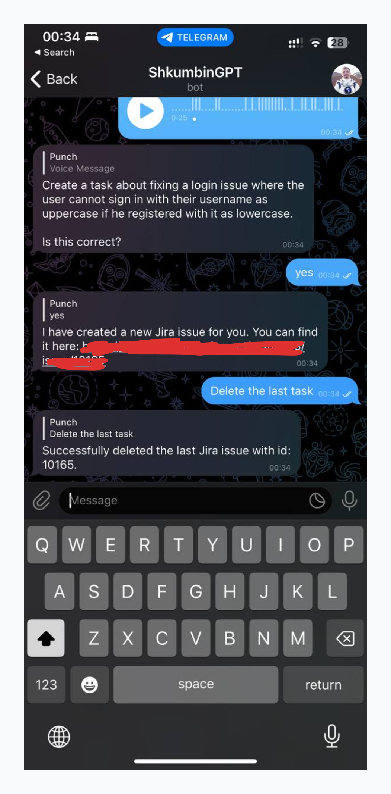
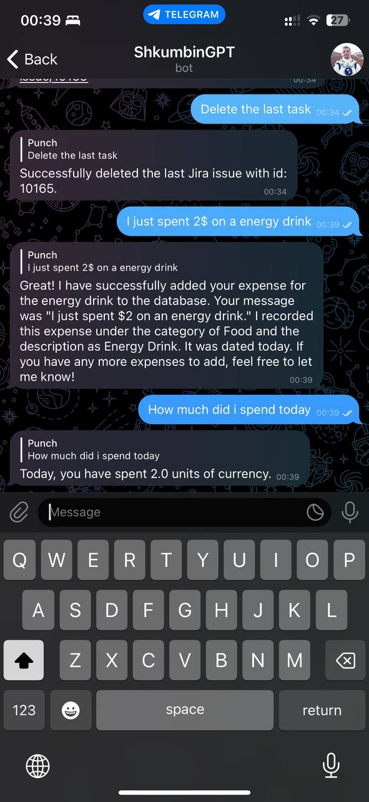

# Ditching Conventional UIs: My Task Management Experiment with ChatGPT and Telegram

Everyone who’s dabbled in project management knows the drill: the tedious process of listing out tasks. Whether it’s Jira, Asana, or the age-old to-do list, I’ve always found the task of documenting my swirling thoughts into these platforms a bore. Even worse, once I sit to jot them down, some ideas magically disappear, only to pop up again when I least expect.

Then along came ChatGPT’s mobile app. The game-changer? A record feature. It doesn't just transcribe what you say; it interacts with it. And that got me thinking: Could I use ChatGPT's API, coupled with Whisper's, to cut out the task-listing middleman?

**Enter the Telegram Bot**

So, I decided to play around with the idea. I set up a bot on Telegram that takes in my audio, processes it through ChatGPT and Whisper, and then communicates with Jira's API to create tasks. Oh, and for the times I don't feel like speaking? It works with text too.

**Why Telegram?**

For those scratching their heads about my choice of Telegram, it’s all about the API. It's robust, and with a simple DigitalOcean server (which costs roughly $4/month), the bot keeps ticking without a hitch.

**Expanding the Horizon: The Expenses Manager**

The initial success had me pushing boundaries. ChatGPT has this knack for crafting solid SQL. So, I thought, "Why not an expense tracker?" I set up an SQLite, gave ChatGPT a brief on my expense schema, and boom. Now, I command it to track expenses or fetch reports, and it manages the database duties.

**Is This the Future of UIs?**

My little experiment has made me reevaluate the need for traditional UIs. With a powerhouse like ChatGPT, can't we just lay out a database and let AI handle the rest? Tracking expenses, managing employees, handling tasks - the possibilities are endless.

In wrapping up, while UIs have their place, I can't help but think that voice or text commands, powered by evolving AI, might just be the next big thing in managing our digital lives.
