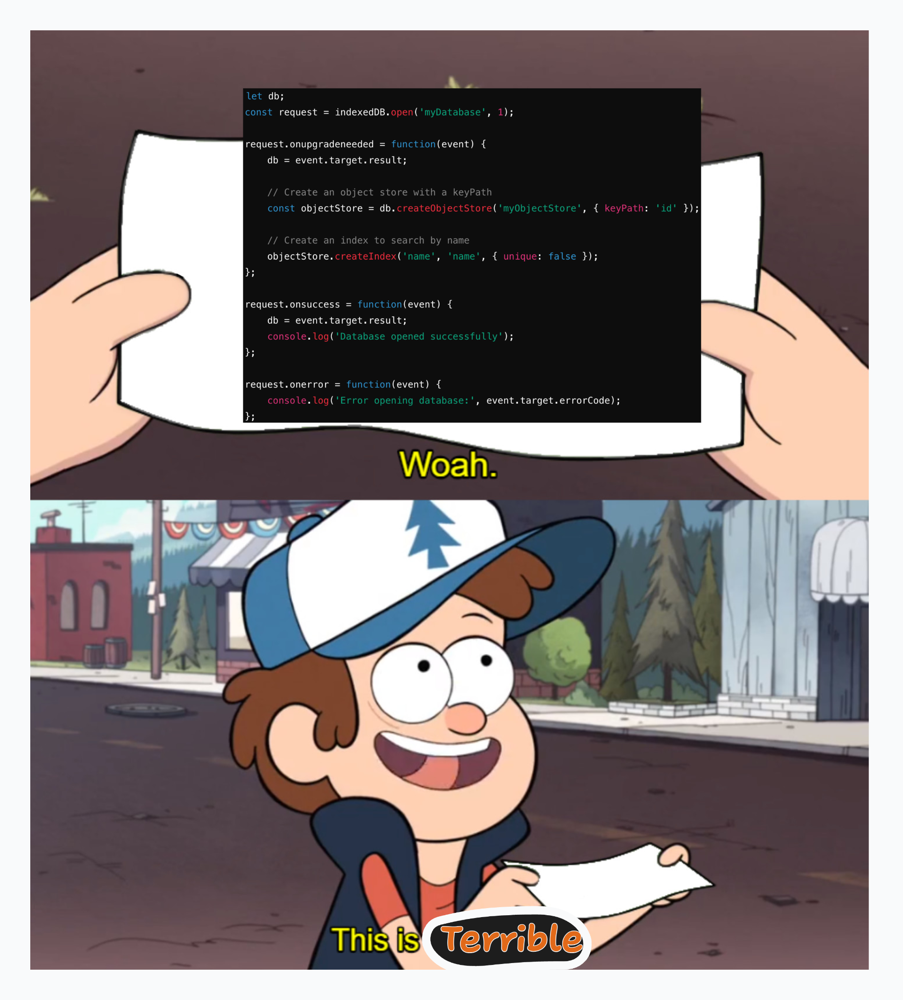
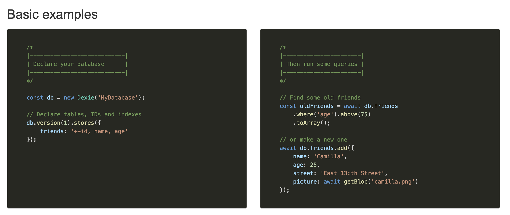
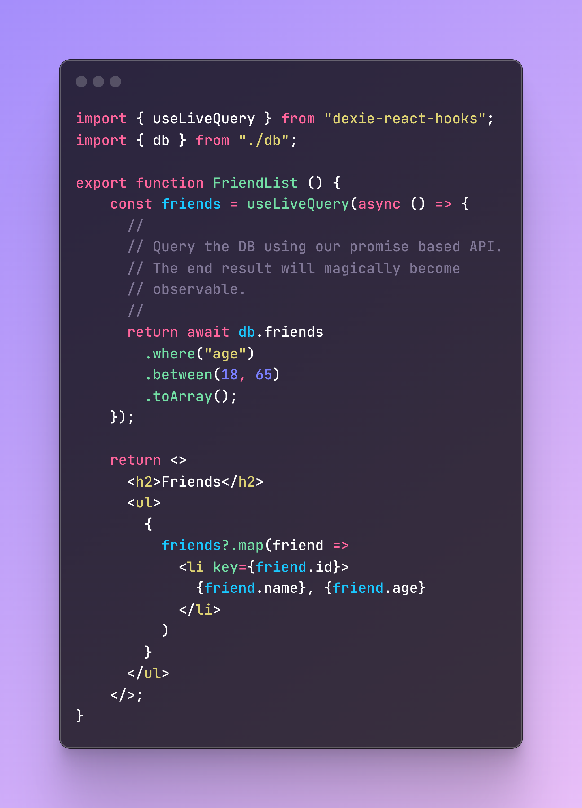
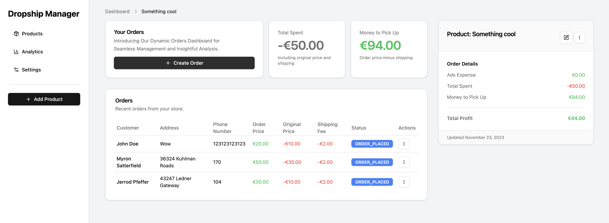

Last weekend, like many weekends, I started a new project without any planning. I wanted to create a drop-shipping management site so that a friend wouldn’t have to manage all of that stuff with Google Sheets. Of course, the first thing on my mind was choosing the stack, and some things were clear from the beginning.

The frontend was clear: I would use shadcn/ui and Tailwind, not because I like them (especially not Tailwind), but with tools like [v0.com](http://v0.com/) and [claude.ai](http://claude.ai/), they would take a lot of work off my hands.

React (of course) was my choice, and for routing, I wanted to get more familiar with `@tanstack/react-router`. I also wanted to use `@tanstack/react-query` for data fetching.

For the backend, I planned to use Hono, D1, Drizzle, and Firebase Auth, but then I started asking myself a question:

# Is this a overkill?
A server that I end up neglecting, a database, requests, etc. Is all this really needed? Should it take that much effort just to create something that a Google Sheet was managing until now? The answer is obviously no. So I wanted to take a different approach and make it fully local. I had heard that now you can create a SQLite database in the browser, so I thought I could hook that up with Drizzle and make it fully local. After some minutes of scrolling, I realized that Drizzle lacks documentation on how to handle this case, particularly with migration. There were also other alternatives like PGlite for Postgres, but it didn’t support permanent storage.

At that moment, I remembered IndexedDB. I had never actually seen code using it or encountered any API for it; I just knew it existed. I started researching it, and holy shit—the API is terrible. It's so fu*%&#ng terrible. As someone who wanted to use Drizzle and loved their API, this was complete dog shit.




But I still liked the idea of a browser having its own database that can handle data efficiently, so I started looking for a wrapper around it. That’s when I found:

# Dexie.js
Dexie seems like the solution I was searching for—a Drizzle-like API for a browser database that is efficient. This is how the API looks:



Or for us TypeScript lovers:

```typescript
export interface Product {
    id?: number; // Optional, as it will be auto-incremented
    name: string;
    image: string;
    adsExpense: number;
}

export enum OrderStatus {
    ORDER_PLACED = 'ORDER_PLACED',
    ORDER_SHIPPED = 'ORDER_SHIPPED',
    ORDER_DELIVERED = 'ORDER_DELIVERED',
    ORDER_CANCELLED = 'ORDER_CANCELLED',
}

interface Order {
    id?: number;
    name: string;
    address: string;
    ...
}

// Define the database schema
class MyAppDatabase extends Dexie {
    products!: Table<Product, number>;
    orders!: Table<Order, number>;
    constructor() {
        super('myAppDatabase');
        this.version(1).stores({
            products: '++id, name, image, adsExpense',
            orders: '++id, name, address, ...',
        });
    }
}
```

So that's how I was going to do it. Since it’s asynchronous, I thought all I needed to do was hook the querying to `@tanstack/react-query` and be done with this part.

# Or do I?
Not really. Dexie also has a React hook called useLiveQuery, which allows you to write a query in a hook, and it will auto-update if any data inside updates. 🤯 It feels like magic working like this.



Under the hood, I _*assume*_ that once a query happens, it tells an async local storage that the hook uses a certain table, then it subscribes to changes on that table and reruns the query. But this was one of the best developer experiences I’ve had in a while. Combined with the auto-generated UI from v0/Claude and the amazing router of Tanstack, I was able to finish the project in a couple of hours.

# Did I actually solve an issue?
Nope, not really. Even though it was working perfectly and looking perfect, the user wanted to be able to collaborate, view the products across devices, etc. So, Google Sheets was still a better solution than mine.



# Conclusions & What would be good

liked that I used IndexedDB, and about the title—I know that IndexedDB is also a DB; it even has it in the name, lol, but it’s not what you think of when you think of a database.

Dexie also supports “syncing” with its own Dexie Cloud, and it’s pretty cheap, but it works in a weird way. It charges per user, and you need to put the database in the codebase, so it would be one database for all users.

If someone would build something identical to Dexie, but also with backend libraries and different authentication and syncing capabilities (e.g., using Google Auth with Google Sheets as a syncing DB 🤯), or using your own authentication with a document DB for syncing, then in this case, the database wouldn’t need to be a capable database—the whole syncing could be an S3 file.

There would be a lot of use cases for this—for frontend data that needs to be persisted, you wouldn’t need to go to your backend team every time to create a new column for some new data that you can put and read from. Some use cases would be:

- Saved filters: If you have a panel that contains complex filters, it’s not the best developer experience, but it’s very user-friendly.
- Dark mode or language settings that work across systems.
- Marking something to view later.
- Adding a note to a specific page.
- A simple app like the one I explained.

Front-end-controlled, persisted, and synced schema storage would solve a lot of issues and make developing small apps very simple. It would be funny if it already existed and I wrote this for nothing.
