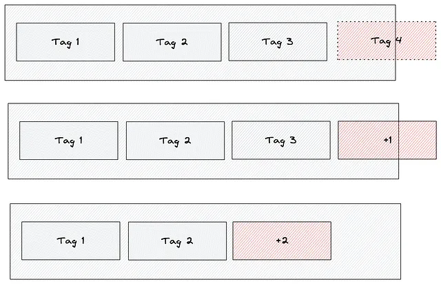
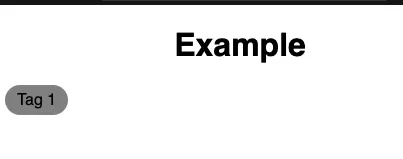
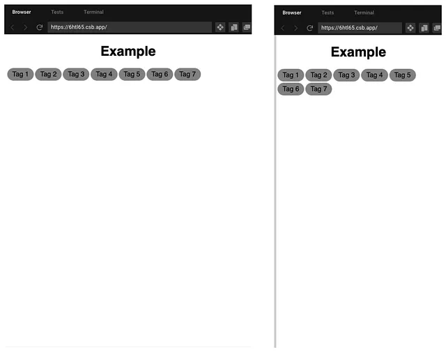
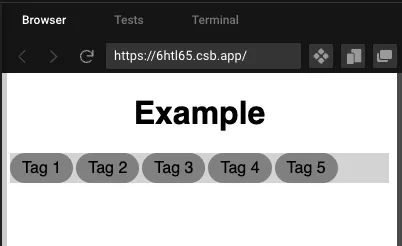
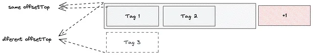
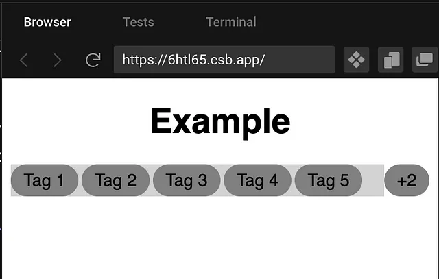

## Handling ellipsis with Divs in React

Have you ever needed to display a list of tags or elements in a single row, but wanted to avoid taking up too much space? If so, you may have considered displaying only the tags that fit on the row, along with an indicator of how many tags are actually present.




Although the problem may seem simple, finding a solution can be quite complex, requiring the use of various techniques and considerations to achieve the desired outcome.

Let’s Start with a simple Tag

```jsx
function Tag(props: { children: ReactNode }) {
  return <div className="tag">{props.children}</div>;
}
```

```css
.tag {
  height: 30px;
  padding-left: 12px;
  padding-right: 12px;
  display: flex;
  justify-content: center;
  align-items: center;
  background-color: grey;
  border-radius: 24px;
}
```



> The only thing we need to take care of here is it should have a static height

Now let's create a wrapper for the tags

```jsx
const tags = ["Tag 1", "Tag 2", "Tag 3", "Tag 4", "Tag 5", "Tag 6", "Tag 7"];

function TagsContainer() {
  return (
    <div className="tags-container">
      {tags.map((tag, index) => (
        <Tag>{tag}</Tag>
      ))}
    </div>
  );
}
```

```css
.tags-container {
  display: flex;
  gap: 3px;
  flex-wrap: wrap;
}
```

One note here to check is that we used wrap so the elements break into a new line



Now we need to limit the height so the broken items do not show, we do that simply by adding a height and `overflow: hidden`

```css
.tags-container {
  display: flex;
  gap: 3px;
  flex-wrap: wrap;
  height: 30px;
  overflow: hidden;
  background-color: lightgray;
}
```



To add the + indicator we are going to separate it from the main logic into a tags-row

```jsx
function TagsContainer() {
  return (
    <div className="tags-row">
      <div className="tags-container">
        {tags.map((tag, index) => (
          <Tag>{tag}</Tag>
        ))}
      </div>
      <Tag>+?</Tag>
    </div>
  );
}
```

```css
.tags-row {
  display: flex;
}
```

The Javascript part.

We need a way to find which elements break.



```jsx
function TagsContainer() {
  const ref = useRef<HTMLDivElement>(null);
  const [count, setCount] = useState<number>(0);
  useLayoutEffect(() => {
    const parentElement = ref.current;
    if (!parentElement) {
      console.error(`Element not found.`);
      return;
    }

    let overflowedElements = 0;
    for (let i = 0; i < parentElement.children.length; i++) {
      const childElement = parentElement.children[i] as HTMLElement;
      if (childElement.offsetTop !== parentElement.offsetTop) {
        overflowedElements++;
      }
    }

    setCount(overflowedElements);
  }, []);

  return (
    <div className="tags-row">
      <div className="tags-container" ref={ref}>
        {tags.map((tag, index) => (
          <Tag>{tag}</Tag>
        ))}
      </div>
      {count > 0 ? <Tag>+{count}</Tag> : null}
    </div>
  );
}
```

Although this approach functions effectively, there is one issue — it does not operate when the window is resized.



To make it work on resize events, we can incorporate a resize observer. I used the hook from [mantine-hooks](https://github.com/mantinedev/mantine/blob/master/src/mantine-hooks/src/use-resize-observer/use-resize-observer.ts). When implemented in conjunction with the rest of the code, it would look something like this.

```jsx
function TagsContainer() {
  const [ref, rect] = useResizeObserver();
  const [count, setCount] = useState<number>(0);
  useLayoutEffect(() => {
    const parentElement = ref.current;
    if (!parentElement) {
      console.error(`Element with ID not found.`);
      return;
    }

    let overflowedElements = 0;
    for (let i = 0; i < parentElement.children.length; i++) {
      const childElement = parentElement.children[i] as HTMLElement;
      if (childElement.offsetTop !== parentElement.offsetTop) {
        overflowedElements++;
      }
    }

    setCount(overflowedElements);
  }, [ref, rect]);

  return (
    <div className="tags-row">
      <div className="tags-container" ref={ref}>
        {tags.map((tag, index) => (
          <Tag key={index}>{tag}</Tag>
        ))}
      </div>
      {count > 0 ? <Tag>+{count}</Tag> : null}
    </div>
  );
}
```


https://codesandbox.io/embed/intelligent-curie-6htl65?fontsize=14&hidenavigation=1&theme=dark
