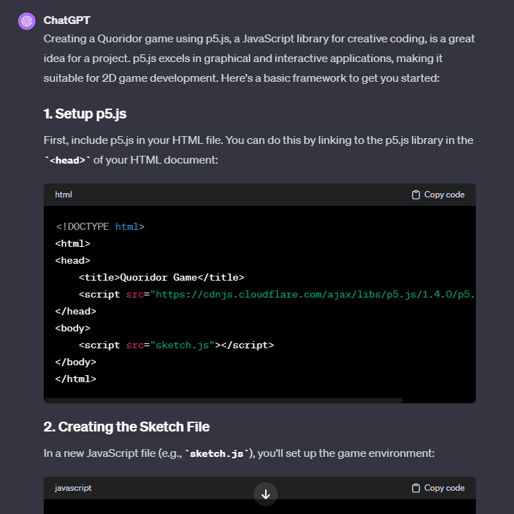
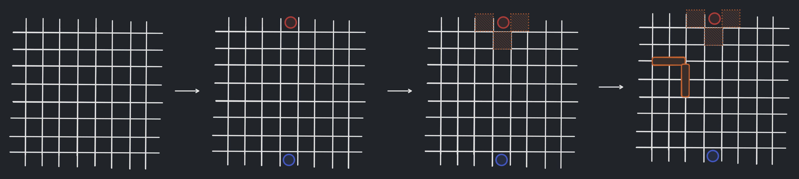
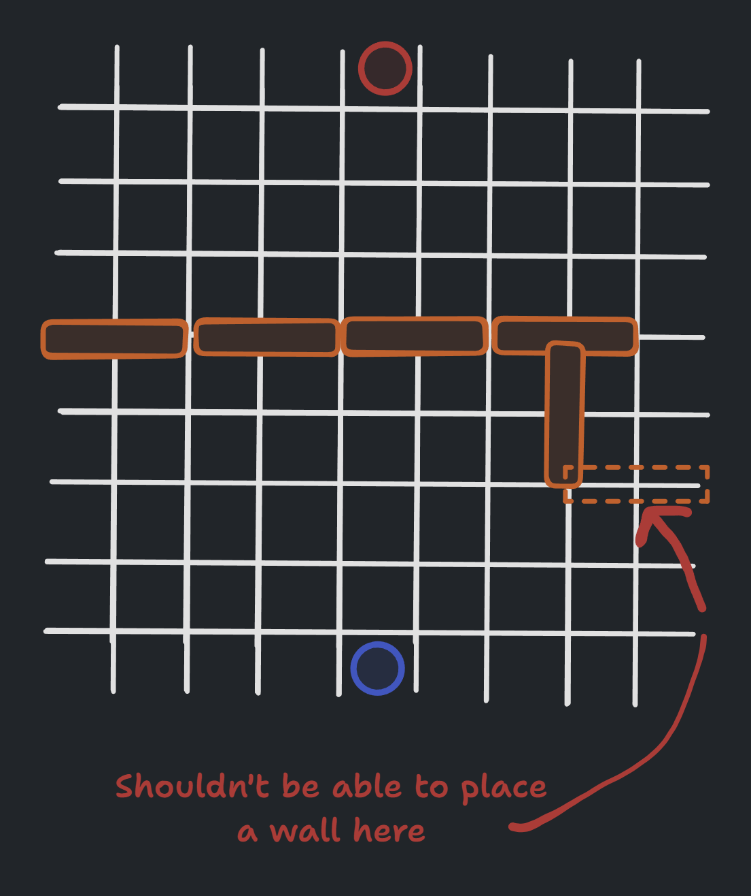
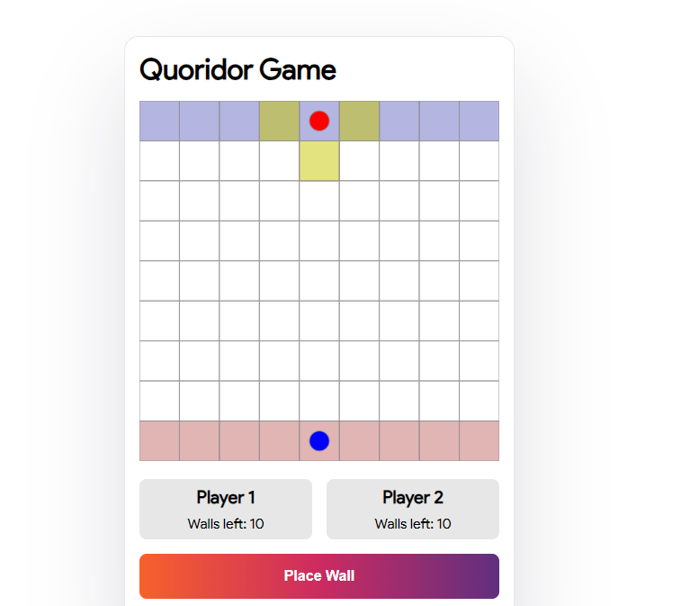

# My Journey from Idea to Playable Web Game with AI Assistance

## The Birth of an Idea

In my office, we have a unique way to unwind: a game called Corridor that has become quite the hit. It's a strategic game, usually played on a 9x9 board where two players aim to reach the opposite side while obstructing their opponent's path. Picture a chess-like challenge, but with the added twist of movable walls. This engaging pastime led to a light-hearted joke from a colleague about porting it to PlayStation, sparking my curiosity. How hard could it be to develop this for the web?

## The First Steps

Unlike my usual project approach, I embarked on this challenge with minimal knowledge about web game development. My toolkit consisted only of familiarity with P5.js for creating 2D graphics in an HTML canvas. The first task? Establishing the basics. I turned to ChatGPT for help and received a basic blueprint: a 9x9 board set up for a single-player experience.

## From Blueprint to Game

With the foundation laid, the game was far from finished - it was merely a grid with player tokens. Enter CopilotChat, a service by GitHub I accessed via WebStorm, my preferred IDE. The development unfolded in iterations: highlighting possible moves, defining player turns, enabling player movement, and integrating wall placements and orientations.

The real challenge was ensuring that a player's path to the opposite side remained unblocked - a complex logic puzzle. CopilotChat provided guidance, but manual adjustments were necessary.

## A Playable Prototype

Four hours in, the game transformed from a concept to a playable prototype, a remarkable feat given my lack of prior game development experience. But I didn't stop there.

## Going Multiplayer

My next goal? Multiplayer functionality. Initially, I considered a server-based approach with WebSockets, but instead, I opted for simplicity using peer.js for a WebRTC peer-to-peer connection. The result? A game where movements are shared between players through WebSocket, admittedly without robust security - but perfect for a fun, experimental project.

## The Final Product

Today, the game is more than just a pastime among friends. It's a zero-cost, open-source project hosted on Cloudflare pages, with nearly all of its code written by AI. You can explore the repository on my GitHub. The only personal touch? The game's styling, which I proudly crafted myself.

https://quoridor.shkumbinhsn.com/

## Conclusion

This journey from a casual office game to a fully functional web game, assisted significantly by AI, was both challenging and exhilarating. It’s a testament to how AI can serve as a powerful tool in the hands of a determined developer. Check out the game and dive into the code – maybe it'll inspire your next project!

